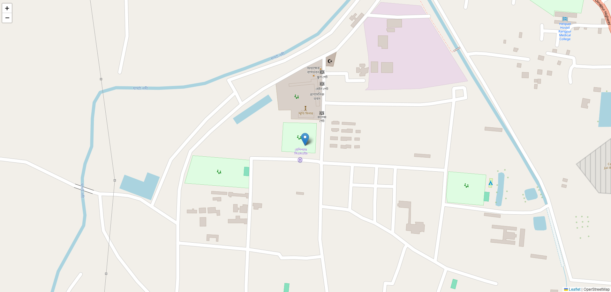

# Real-Time Tracker

This is a simple Node.js application that demonstrates real-time communication using Express, Socket.io, and Leaflet for map integration. The application allows users to connect to a server and interact in real-time through a web interface.

## Project Structure

├── views/
│ └── index.ejs
├── public/
│ ├── css/
│ │ └── style.css
│ └── js/
│ └── script.js
├── app.js
└── package.json

## Features

- **Real-time communication**: Uses Socket.io for real-time bidirectional communication.
- **Map integration**: Utilizes Leaflet to display maps.
- **realtime location**: Display realtime location in map integration.
- **Simple, clean UI**: Built with EJS templating engine.

## Installation

### Prerequisites

- Node.js (v12 or higher recommended)
- npm (Node Package Manager)

### Setup

1. **Clone the repository:**
    ```bash
    git clone https://github.com/thamidtuhin74/RealtimeTracker.git
    cd your-repo-name
    ```

2. **Install dependencies:**
    ```bash
    npm install
    ```

3. **Run the application:**
    ```bash
    nodemon app.js
    ```

4. **Access the application:**
   Open your browser and navigate to `http://localhost:3000`.

## Usage

- Once the server is running, connect to the application via the browser.
- The server will log the connection in the console, and you will see a basic interface with Leaflet map integration.

## Configuration

### `app.js`

This file sets up the Express server, serves static files, and manages real-time connections using Socket.io.

### `views/index.ejs`

This is the main view file rendered by Express. It contains the HTML structure of the application.

### `public/css/style.css`

Custom styles for the application.

### `public/js/script.js`

Client-side JavaScript to handle Socket.io connections.

## Screenshots / Video Demo



If you'd like to see a live demo of the application, [click here to watch the video](demo.mp4).

## License

This project is Open is reuse.

## Acknowledgments

- [Express](https://expressjs.com/)
- [Socket.io](https://socket.io/)
- [Leaflet](https://leafletjs.com/)

